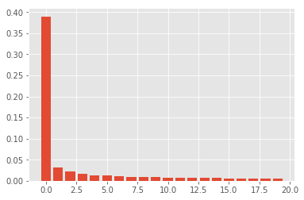
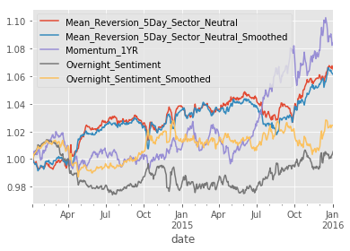
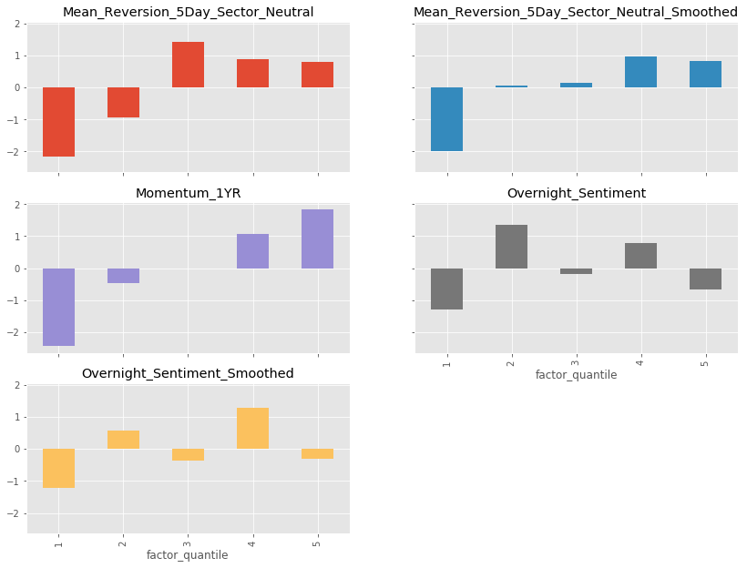
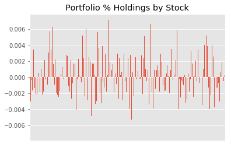
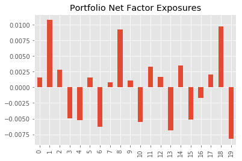

# Multi-factor Model
---

This project is a production ready prototype model that 
  - builds a cross-sectional statistical risk model using PCA, which is used to build a portfolio along with a number of momentum, mean reversion, and sentiment alpha factors 
  
 

  - universe: US equities, top 500 in terms of dollar volume
  - evaluates the alpha factors, combining the promising signals into a single alpha vector   
  

  - evaluates a number of approaches to constructing the optimal portfolio given objective/constraints 
  
 

  
**note:** uses end of day pricing data from Quotemedia and sector data from Sharadar, which could not be shared due to licensing restrictions

